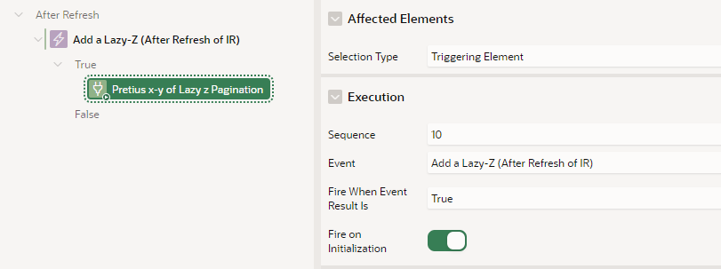

# Pretius x-y of Lazy z Pagination Plugin

  

- [What is the Pretius x-y of Lazy z Pagination Plugin](#what-is-the-pretius-x-y-of-lazy-z-pagination-plugin)
- [Release History](#release-history)
- [Installation](#installation)
- [Usage](#usage)
- [License](#license)
- [Free Support](#free-support)
- [Bug Reporting and Change Requests](#bug-reporting-and-change-requests)
- [Implementation Issues](#implementation-issues)
- [Become a Contributor](#become-a-contributor)
- [Commercial Support](#commercial-support)

## What is the Pretius x-y of Lazy z Pagination Plugin

The "Pretius x-y of Lazy z Pagination" plugin is designed to optimize Oracle APEX Interactive Reports (IR) when dealing with large datasets. If you have an IR on a massive table and experience slow performance due to pagination (the **X-Y of Z** row count display), this plugin addresses that problem by calculating and displaying the **Z** (total row count) lazily, after the report refreshes.

## Release History

24.1.1
- Initial version

## Installation

1. Download the plugin from the [GitHub repository](https://github.com/Pretius/pretius-x-y-of-lazy-z).
2. Import the plugin into your APEX application via the Shared Components section.

## Usage

To use the plugin in your Interactive Report:

1. Set up an IR on a large dataset.
2. Ensure Pagintation is set to **Row Ranges X to Y** (default)
3. Add the plugin to the **After Refresh** event of the Interactive Report.
4. In **Affected Elements**, use the **Triggering Element** as the **Selection Type**
5. Ensure **Fire on Initialization** is enabled

This approach ensures that the total row count (**Z**) is loaded asynchronously, improving the overall performance of your Interactive Report.

## Settings

Use Cache
  - Enabled (Default) : Caches the rowcount after fetching. Refetches & caches if filters change
    - Pros: Silky smooth experience for the user
    - Cons: Rowcounts may become stale
  - Disabled : Fetches fresh rowcounts after each pagination or filter change
    - Pros: Rowcounts correct after each fetch
    - Cons: More spinners/waiting for the users 

## License

Licensed under the [MIT](LICENSE) license.

## Free support
Pretius provides free support for the plugins at the GitHub platform. 
We monitor raised issues, prepare fixes, and answer your questions. However, please note that we deliver the plug-ins free of charge, and therefore we will not always be able to help you immediately. 

Interested in better support? 
* [Become a contributor!](#become-a-contributor) We always prioritize the issues raised by our contributors and fix them for free.
* [Consider comercial support.](#commercial-support) Options and benefits are described in the chapter below.

### Bug reporting and change requests
Have you found a bug or have an idea of additional features that the plugin could cover? Firstly, please check the Roadmap and Known issues sections. If your case is not on the lists, please open an issue on a GitHub page following these rules:
* issue should contain login credentials to the application at apex.oracle.com where the problem is reproduced;
* issue should include steps to reproduce the case in the demo application;
* issue should contain description about its nature.

### Implementation issues
If you encounter a problem during the plug-in implementation, please check out our demo application. We do our best to describe each possible use case precisely. If you can not find a solution or your problem is different, contact us: apex-plugins@pretius.com.

## Become a contributor!
We consider our plugins as genuine open source products, and we encourage you to become a contributor. Help us improve plugins by fixing bugs and developing extra features. Comment one of the opened issues or register a new one, to let others know what you are working on. When you finish, create a new pull request. We will review your code and add the changes to the repository.

By contributing to this repository, you help to build a strong APEX community. We will prioritize any issues raised by you in this and any other plugins.

## Commercial support
We are happy to share our experience for free, but we also realize that sometimes response time, quick implementation, SLA, and instant release for the latest version are crucial. That’s why if you need extended support for our plug-ins, please contact us at apex-plugins@pretius.com.
We offer:
* enterprise-level assistance;
* support in plug-ins implementation and utilization;
* dedicated contact channel to our developers;
* SLA at the level your organization require;
* priority update to next APEX releases and features listed in the roadmap.

